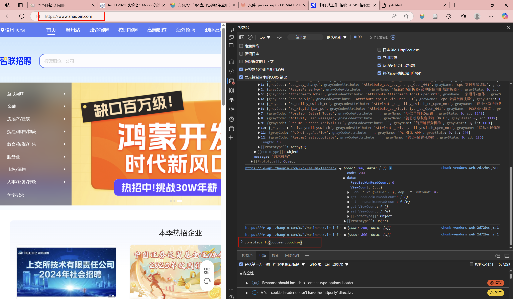

是一个智联招聘网站的爬虫，可以爬取指定行业的所有职位的薪资、地点、工作要求和职位特点等信息
# 启动步骤
1. 安装`playwright`,`scrapy`，安装完`playwright`之后执行`playwright install`(大概是这个命令，具体的我也忘了可以g一下，这个playwright是模拟浏览器的，然后这样install一下是装个playwright的浏览器)

2. 登录智联招聘获取自己的cookies
   
    

    将`/zhaopin/constant.py`替换为自己的cookies(模仿登录行为)

3. 修改`Requester.py`第13行中的参数为自己所要爬取的行业，所有行业在`/zhaopin/jobs.json`里
4. 修改`Requester.py`第73行和第140行的路径(每次爬取完后都要换)，这是数据的保存路径
